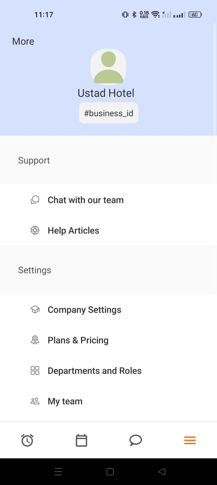

# Reflections on skills learned from DGL Courses

<details>
  <summary> Effective use of javascript techniques</summary>

## Effective use of javascript techniques

So I was a student in the course `DGL 113 CVS1 2024 Winter Term`

That course was really helpful it was taught by Frank Lu, He taught CPS-100 too, that was my first computer science course ever and I am always grateful for helping me build my undertandings and giving me a good foundation on programming techniques.
Now, during the course `DGL 113` I learned a lot of javascript techniques one of them is the use of `setTimeOut` funciton. This function helped me to solve on of the major issue in my project. I will explain how this function helped me, first let me give a brief description about this function

### setTimeOut function:

So this is a javaScript buit-in function that is used to delay an action for a given time.

```javascript
setTimeout(() => {
  setIsAuthenticated(true);
}, 1000);
```

This is an example how I used the function in my project. Here there are two things we have to focus on:

- First, the action that has to be delayed in this case that is `setIsAuthenticated(true)`
- Second, how much time do we have to delay, here that is `1000`. Note that this is 1000 milli seconds milli means 1/1000. so here its 1000 milli seconds that is 1s.

#### How this function helped me in my project

So was struggling with an issue in my project

### Problem:

So while creating a new user, we navigate to the home page but the home page does'nt have the created user information. I will explain this in a simple step by step

1. Below is a simple demonstration of the function that create new user, the full version of the code is in `src/screens/EmployeeCreate.js`

```javascript
const handleCreateUser = async () => {
  const userCredential = await createUserWithEmailAndPassword(
    auth,
    email,
    password
  );
  const user = userCredential.user;
  await createUser(userData);
};
```

- The function `createUserWithEmailAndPassword()` is provided by firebase-auth package. This create a user in firebase authentication and create an authentication token
- The function `createUser()` is an api calling function defined by me in for calling the api in `src/service/api.js` file.

2.  Below is a simple version of my home screen that switch the navigation based on the users authentication state.

```javascript


const Main = () => {
const [isAuthenticated, setIsAuthenticated] = useState(null);

onAuthStateChanged(auth, async user => {
if (user) {
setIsAuthenticated(true);
} else {
setIsAuthenticated(false);
}
});
return (
<NavigationContainer>
{isAuthenticated ? <UserStack /> : <AuthStack />}
</NavigationContainer>
);
};

```
 - The function `onAuthStateChanged()` is a function provided by the firebase-auth which get the state of the user whether authenticated or not.This function will get the user token immideattly after creating from the page usercreation page using the function `createUserWithEmailAndPassword()` as mentioned before.
 - `isAuthenticated` is a boolean that becomes true when authentication happens.
 - When the `isAuthenticated` is true it we go to the `UserStack` according to the logic ` {isAuthenticated ? <UserStack /> : <AuthStack />}`

#### Reason for the problem:
* So the problem is user go to the `HomeScreen` that is in the `UserStack` right away after the authentication.
* The api function `createUser(userData);`  takes atleast one second to create the date in the firebase database. But we are going to the home page before creating the data in the database 

* In the home page first thing that we do is do an api call to get the user detail using `useEffects`. 

* So we are trying to get the user information in the homepage before creating the user in formation in the database.


### Solution

```javascript


const Main = () => {
const [isAuthenticated, setIsAuthenticated] = useState(null);

onAuthStateChanged(auth, async user => {
if (user) {
setTimeout(() => {
  setIsAuthenticated(true);
}, 1000);
} else {
setIsAuthenticated(false);
}
});
return (
<NavigationContainer>
{isAuthenticated ? <UserStack /> : <AuthStack />}
</NavigationContainer>
);
};

```

* There is only one change in the App.js file that is we wrap the `setIsAuthenticated(true)` with a `setTimeOut` function and delay the action for a second.

* With this one second delay we navigate to the `HomeScreen` after one second of validation.

* This one second is enough for the api call `createUser()` to create the user data in the firebase database. 

* And now when we try to get user data in the `HomeScreen` we get the user because its already create a second ago. 

This is how we see the user information properly after creating a user in this case.


### In conlusion

This is just one instance where learning the javaScript helped me to solve an issue in my project. Moreover, this project's fronend is build in `React Native`, which is a javascript framework. So with a good understanding of the javascript it was helpful for me to learn this frame work for the project.

#### For further reference

Here I am showing the code from two pages
 - `src/screens/EmployeeCreat.js` This where the usercreation section is shown from.
 - `App.js` (that is in the root of the react-native project) this is where the navigation between two stacks are shown.
 - Note that a simplified version of the code is provided for helping the reader to understand the logic quickly.
 - The for further details on the api calling , home screen, api function visit the `src/services/api.js` , `src/screens/Home.js` and `app.py` in this repository respectively.

</details>


<details>

<summary> Ability to create user friendly UI's</summary>


##  Ability to create user friendly UI's

The courses: UI/UX, DGL 309

So I was a student in UI/UX in the last year. And this course helped me alot to create effiecient user interfaces and make me able to under stand the UI design principles like typography, color theory, layout.

And the course 309 gave me detailed understanding ot the color theory and layout principles.

So, at the first I did'nt had any particular reason to for choosing a colors or placing a ui element. But, after taking these courses. I it help me to understand how to organise the content and design the components with consistency and reducting the cognitive loads of the user.


Below are some screens from my project:

<div style="display: flex; justify-content: space-between; width:100vw">
    
    
    
</div>

And in my project I have seperate folder `src/components`for all the component like  buttons, title and others to make UI consistent and Effective.

### In conclusion:

With the help of the courses , I am able to understand  UI design principles like typography, color theory and  layouts that helped me to design the interfaces in my application properly and to organize the contents effectivly.

</details>

<details>

<summary> Able to Use Adobe XD Efficently </summary>

## Able to Use Adobe XD Efficently 

The course: UI/UX. 

So in this course I was taught how to create wireframes and layout effectively and simply using adobe xd. There are lot of techniques to make it easier like repeat grid, where use can repeat the components that you want into prefered number of row and columns. 


Below are the wireframes that I have created for the project

- [Lo-fi wire frame](https://xd.adobe.com/view/316b1a7e-4e04-4166-b7e9-26aa7a32dd17-6438/screen/9703718e-d55e-4349-944e-01d4d5a9fe57) 

So for the feature complete presentation, I have used adobe xd to show different major steps in the application assuming that it will be helpful instead of showing the real application. Below are the Adobe xd flows that I have created to demonstrate how to perform major tasks in my application

- [Business account creation steps](https://xd.adobe.com/view/abb0e76d-e4fd-458e-b585-2d8bc9181396-fee3/)

- [Create a team](https://xd.adobe.com/view/1a8a80d6-b7f6-4275-9451-88ea0c8a156e-4fd9/)

- [Add new member](https://xd.adobe.com/view/4dc9c77d-6271-4362-b72d-6c5bbf94aa9f-189a/)

- [Create shifts](https://xd.adobe.com/view/1841303b-927a-41ed-8807-d8e9e4c176de-4d12/)

- [Share the business id](https://xd.adobe.com/view/dee9373a-f801-47ba-85bf-b83bbe82d085-8bba/)

- [Employee account creation](https://xd.adobe.com/view/3a8b806c-12ca-4421-94b9-82308b9518a8-6fd8/)


## In conclusion

Learning Adobe XD through this UI/UX course has enhanced my prototyping and wireframing capabilities. The tool's powerful features helped streamline my workflow and allowed me to create consistent, professional layouts efficiently. 

</details>


<details> <summary>How to use Git branching properly</summary>

## How to use Git branching properly

 The course : DGL: 104 App development foundation.


Through this project, I gained practical experience in using Git version control effectively, particularly in branching, creating pull requests, merging. One of the key features I worked on was the sign-in functionality, which required careful version control to ensure code stability.

- [Git branch for sign in](https://github.com/suhail3728/WorkingHours/tree/Sign-in-screen) 

This the git branch that I used to create the sign in page seperately. 

Here you can see the git commits only for the sign in page creation. This is really helpful as it seperate the commits from the rest of the commits.

This is also helpful not to develop any new feauters with some risks in the main branch and develop in an Isolated branch and verify that everything is workig perfectly and then to create  a pull request and merge that to the mains branch.
</details>


<details>
<summary> Refactoring techiques</summary>

The course: Introduction to php.

So according to the course we where watching a youtube video from a chanel [laracast](https://www.bing.com/videos/riverview/relatedvideo?&q=laracast+introduction+to+php&qpvt=laracast+introduction+to+php&mid=116E749B94A6CA9A9A2B116E749B94A6CA9A9A2B&mmscn=mtsc&aps=0&FORM=VRDGAR). This is a 11 hours video starting from the basics of php to advanced steps. 

So three things that was useful for me in this project because of this course

 * To organize the entire code into different categories according to the type of the code

 ```
├ App.js
src/
├── assets/
│   └── images/
├── components/
├── config/
├── constants/
├── navigation/
├── screens/
└── services/
 ```

 This is my code structure that here I categorized the the codes into different section according to the type of code like screens, configuration for the database configurations ect.


 * To create components that is reusable in the code. 

 ```javascript

 export const DepartmentButton = ({
  IconName,
  IconColor,
  IconBackgroundColor,
  title,
  onPress,
  containerStyle,
  iconContainerStyle,
  textStyle,
  IconSize = 22,
}) => {
  return (
    <TouchableOpacity 
      style={[styles.departmentButton, containerStyle]} 
      onPress={onPress}
    >
      <View style={[styles.departmentContent]}>
        <View style={[styles.departmentIconContainer, 
          { backgroundColor: IconBackgroundColor },
          iconContainerStyle
        ]}>
          <Ionicon
            name={IconName}
            color={IconColor}
            size={IconSize}
          />
        </View>
        <Text style={[styles.departmentText, textStyle]}>{title}</Text>
      </View>
    </TouchableOpacity>
  );
};

 ```

 This a custom button that I have created in my project, here we can pass the parameters and reuse the button instead of writing the code by itself again and againg. This was really helpful for me that I learned from this course.

</details>


<details>

<summary>  Project managemet techniques </summary>
 </details>

</details>


